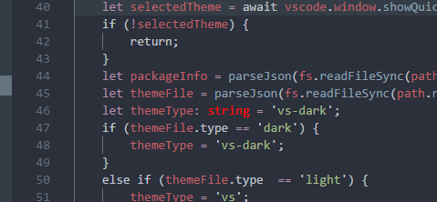

# Contributing

## Reporting Bugs/Providing Suggestions

If you see any weird theming issues or have any suggestions please open an issue with a screenshot of the problem or suggestion.

For example in the following image the type `string` is colored incorrectly.

## Testing and Building

I am currently testing this extension with node v7.4.0.

### Setup Builder

1. Get [base16-builder-typescript](https://github.com/golf1052/base16-builder-typescript) from NPM. `npm install -g base16-builder-typescript`. If you do not install the builder globally you'll need to run the generate steps manually.
2. If you are planning on running the generate steps manually run `base16-builder update` in a directory where you want to setup the builder.

### Generate Themes

1. Run the debugger for this extension in VSCode to create the scripts. They will be located in `out/src/scripts`. You can also run `tsc -w` (requires typescript to be installed `npm install -g typescript`) to compile the scripts and auto compile any changes you make.
2. Change directory to `/path/to/base16-generator/out/src/scripts`
2. Run `node ./build-themes.js`. This will do everything for you.

If you want or need to run the steps manually

> Tip: Create a backup of the `schemes` directory created by the builder before running the next step. This makes it easy to revert changes. 

1. Run `node /path/to/base16-generator/out/src/scripts/generate-light-schemes.js` inside the `schemes` directory. The `schemes` directory should be under `sources` in the directory you setup the builder. This script will generate light versions of schemes from dark version of schemes as well as making sure the scheme title contains Light or Dark as needed.
3. Now in the root of the directory you set up the builder run `base16-builder build --template vscode`. This will create the themes from the generated schemes and put them in `themes`.
4. Remove all files in `/path/to/base16-generator/themes` and then copy the generated themes there.
5. Now run `node /path/to/base16-generator/out/src/scripts/finish-theme.js` inside the `themes` directory.

### Testing Theme Changes

#### Things To Look At

[VSCode Theme Color Reference](https://code.visualstudio.com/docs/getstarted/theme-color-reference)  
[Base16 Website](http://chriskempson.com/projects/base16/)  
[Base16 Theme Examples](https://chriskempson.github.io/base16/)  
[Base16 Repository](https://chriskempson.github.io/base16/)  

1. Modify `reference-theme/base16-ocean-dark.json` using the colors from Base16 Ocean. Make sure to update the comments as necessary.
2. Copy `reference-theme/base16-ocean-dark.json` into the `themes` directory and debug the extension to make sure the changes have the desired effect.
3. Repeat 1 and 2 until you are ready to publish your changes.
4. Modify `builder/templates/vscode/templates/default.mustache` to reflect the changes made in `reference-theme/base16-ocean-dark.json`. Follow the template hex variables found [here](https://github.com/chriskempson/base16/blob/master/builder.md#template-variables).
5. Follow the steps in Generate Themes

## Pushing Changes

When pushing changes make sure that code changes and theme updates are in separate commits. For example [code changes for 1.3.0](https://github.com/golf1052/base16-generator/commit/4eab7a3b13ad951adf1984f1827a7f58480cd208) and separate [theme update commit](https://github.com/golf1052/base16-generator/commit/a331be7eb4b45bc980ebdf7058c59c09b393b12a).
